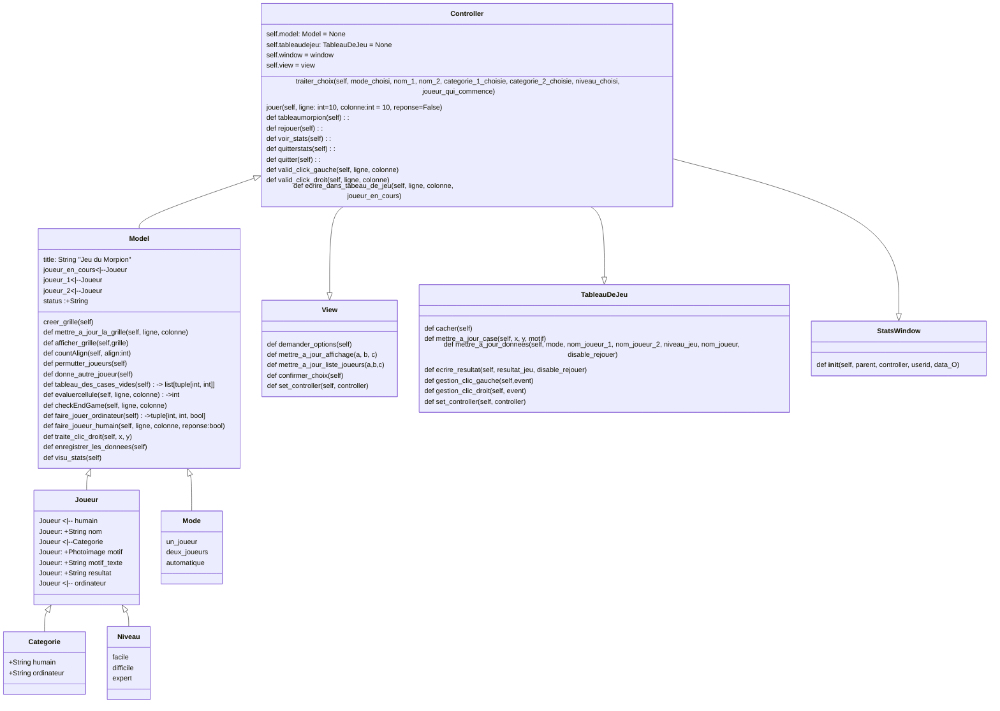

# Analyse du jeu du Morpion
# Réalisation en programmation objet
### 1.1 Le morpion est un jeu:
- Il comporte 2 joueurs, un tableau de jeu de 9 cases
- soit l'ordinateur joue contre lui même (mode automatique)
- soit un joueur joue contre l'ordinateur(mode un_joueur)
- soit 2 joueurs jouent l'un contre l'autre, (mode deux_joueurs)
- les joueurs jouent alternativement et affichent un motif par exemple croix(X) pour joueur_1 
- * et un autre motif par exemple rond(O) pour le joueur_2
- Le but étant de réaliser un alignement de 3 croix ou de 3 ronds avant l'adversaire

#### 1.1.1 Des règles de fonctionnement

Le tableau de jeu est un carré de 9 cases numérotées :
```{Python}
    cellules = [(0, 0), (0, 1), (0, 2),
                (1, 0), (1, 1), (1, 2), 
                (2, 0), (2, 1), (2, 2)]
```
Les 8 alignements possibles sont :
```{Python}
    # création du tableau des lignes, des colonnes et des diagonales
        alignements = [ [(0,0),(1,0),(2,0)] , [(1,0),(1,2),(1,1)] , [(2,0),(2,1),(2,2)],
                          [(0,0),(0,1),(0,2)] , [(1,0),(1,1),(1,2)] , [(2,0),(2,1),(2,2)],
                          [(0,0),(1,1),(2,2)] , [(0,2),(1,1),(2,0)] ]
```

Au départ l'utilisateur (joueur ou spectateur) doit choisir le mode ('automatique', 'un_joueur', 'deuxjoueurs')
##### 1-Si le mode est automatique, l'ordinateur joue seul, le spectateur entre le niveau de jeu et le spectateur clique su le bouton démarrer 
##### 2- Si le mode est un_joueur, le joueur_1 entre son nom, et le niveau de jeu souhaité (facile, difficile, expert), il doit également dire s'il commence à jouer ou non et clique su le bouton démarrer
##### 3- Si le mode est deux_joueurs, ils doivent saisir leur nom et le niveau de jeu souhaité (facile, difficile, expert) l'un des joueurs clique su le bouton démarrer

les joueurs jouent alternativement et il affichent une croix(X) pour le joueur_1 et un rond(O) pour le joueur_2 sur le tableau de jeu
le premier joueur qui réalise un des alignement avec 3 croix ou 3 ronds a gagné, 
si toutes les cases sont remplies sans alignement, le résultat est nul

#### 1.1.2 Si un des joueurs est l'ordinateur
- recensement les cellule vides
- pour chaque cellule vide évaluer les croix ou les ronds présents dans les alignements concernés
- si aucune croix/rond, mettre un poids de 1
- si une seule croix/rond, mettre un poids de 16
- si 2 croix/ronds mettre un poids de 32
- trier les choix en fonction du poids décroissant
- Si le niveau de jeu est facile, on choisit au hasard une cas libre de poids <32
- Si le niveau est difficile on choisit au hasard une case de poids <64
- Si le niveau est expert on choisit une case de poids >=64
- On met un rond/croix dans la case choisie après une temporisation de deux secondes si le mode est 'automatique'

#### 1.1.3 Si le joueur est humain
- acquérir la cellule cliquée 
- vérifier que la cellule est vide
- afficher une croix/rond dans la cellule

#### 1.1.4 Si le joueur est l'ordinateur
##### recenser les cellules vides
##### Pour chaque cellule vide, recenser les alignements correspondants
##### Pour chaque alignement:
- l'alignement ne comporte aucun symbole de l'adversaire: mettre un poids de 0 +16 si la case 1:1 appartient à l'alignement
- l'alignement comporte 1 symbole de l'adversaire: mettre un poids 1+32+16 si la case 1:1 appartient à l'alignement
- l'alignement comporte 2 symboles de l'adversaire: mettre un poids 2+64+16 si la case 1:1 appartient à l'alignement
- Trier les alignement par ordre décroissant
###### Si le niveau est facile:
- choisir un alignement au hasard
###### Si le niveau est difficile:
- choisir au hasard un alignement dont le poids est <80
###### Si le niveau est expert:
- choisir le 1er alignement de la liste

### 1.2 les objets du jeu
un objet cellule
```{Python}
    class Cellule:
        def __init__(self, x, y):
            self.x= x
            self.y= y
        
```
un objet joueur :
```{Python}
    class Joueur:
        def __init__(self,nom:str, categorie): # categorie: humain ou ordinateur
            self.nom=nom
            self.categorie=categorie
            self.motif # a choisir parmi les motif proposés
            
        def demander_nom_joueur(self, joueur:Joueur):
            Label(text="Quel est votre nom ?", font=('Helvetica', 12), fg='red').place(x = 420, y = 100)
            self.NomVar = StringVar(window)
            self.NomVar= Entry(self, textvariable=self.joueur.nom) # Déterminer le type d'objet champ de saisie
            self.NomVar.place(x = 600 , y = 124)
            self.joueur.nom = self.NomVar.trace("w", self.jeu)
                
        def jouer(self,cellule:Cellule)
            # Traiter le cas d'un joueur categorie humain ou ordinateur
            # 1-si humain, acquérir la cellule cliquée
            #   vérifier que la cellule est vide
            #   Si la cellule n'est pas vide, ne rien faire
            #   Sinon afficher motif dans la cellule et changer de joueur
            # 2-si ordinateur, recenser les cellules vides
            #   Pour chaque cellule vide, recenser les alignements correspondants
            #       Pour chaque alignement:
            #           -l'alignement ne comporte aucun symbole de l'adversaire: mettre un poids de 0 +16 si la case 1:1 appartient à l'alignement
            #           -l'alignement comporte 1 symbole de l'adversaire: mettre un poids 1+32+16 si la case 1:1 appartient à l'alignement
            #           -l'alignement comporte 2 symboles de l'adversaire: mettre un poids 2+64+16 si la case 1:1 appartient à l'alignement
            #       Trier les alignement par ordre décroissant
            #   Si le niveau est facile:
            #       choisir un alignement au hasard
            #   Si le niveau est difficile:
            #       choisir au hasard un alignement dont le poids est <80
            #   Si le niveau est expert:
            #       choisir le 1er alignement de la liste    
            
```
un objet Morpion :
```{Python}
    class Morpion:
        def __init__(self, window):
            self.window=window
            self.game = Canvas(self.window, width = 405, height = 405, bg = "white")
            self.trace_tableau_de_jeu()
            self.draw_grid()
            self.gameOn = False # Quand les informations sont correcte, self.gameOn=True
            self.gameMode = ['automatique', 'un_joueur', 'deuxjoueurs']
            self.mode: str
            self.niveauList = [ "Facile", "Difficile" , "expert" ]
            self.niveau: str
            
            
        def demander_mode(self, mode:self.game_Mode)
            Label(text="Quel mode ?", font=('Helvetica', 12), fg='red').place(x = 420, y = 50)
            self.ModeVar = StringVar(window)
            self.ModeVar.set(self.gameMode[0])
            self.ModeOptions = OptionMenu(window, self.ModeVar, *self.gameMode)
            self.ModeOptions.config(width = 10, font=('Helvetica', 12))
            self.ModeOptions.place(x = 600 , y = 44)
            self.mode = self.LevelVar.trace("w", self.jeu)
        
        def demander_niveau(self)
            Label(text="Quel niveau ?", font=('Helvetica', 12), fg='red').place(x = 420, y = 75)
            self.LevelVar = StringVar(window)
            self.LevelVar.set(self.LevelList[0])
            self.LevelOptions = OptionMenu(window, self.LevelVar, *self.LevelList)
            self.LevelOptions.config(width = 10, font=('Helvetica', 12))
            self.LevelOptions.place(x = 600 , y = 84)
            self.niveau = self.LevelVar.trace("w", self.jeu)
           
        def trace_fenetre_principale(self):
            self.window.geometry("750x505")
            self.window.title("Le jeu du Morpion")
            Label(self.window, text="Le jeu du Morpion (OXO)", font=("Helvetica", 20)).place(x=190,y=1)
            
        def trace_tableau_de_jeu(self):
            self.game.create_rectangle(0,0,405,405,fill='white')
            for x in [ 4 , 135 , 270 , 405 ]:
                self.game.create_line(0 , x , 405 , x , fill = 'black' , width = 4)
                self.game.create_line(x , 0 , x , 405 , fill = 'black' , width = 4)
            self.game.place(x = 0 , y = 50)
            
        def joue(joeur:Joueur, cellule:Cellule):
            # Ecrit le motif correspondant au joueur dans la cellule
            pass  
        
        def restart(self):
            pass  
            
        def fin_partie(self):
            # on teste s'il y a un alignement réalisé
            if (self.board[0][0] == self.board[1][0] and self.board[1][0] == self.board[2][0] and self.board[0][0] != 0) \
                       or (self.board[0][1] == self.board[1][1] and self.board[1][1] == self.board[2][1] and self.board[0][1] != 0) \
                       or (self.board[0][2] == self.board[1][2] and self.board[1][2] == self.board[2][2] and self.board[0][2] != 0) \
                       or (self.board[0][0] == self.board[0][1] and self.board[0][1] == self.board[0][2] and self.board[0][0] != 0) \
                       or (self.board[1][0] == self.board[1][1] and self.board[1][1] == self.board[1][2] and self.board[1][0] != 0) \
                       or (self.board[2][0] == self.board[2][1] and self.board[2][1] == self.board[2][2] and self.board[2][0] != 0) \
                       or (self.board[0][0] == self.board[1][1] and self.board[1][1] == self.board[2][2] and self.board[0][0] != 0) \
                       or (self.board[0][2] == self.board[1][1] and self.board[1][1] == self.board[2][0] and self.board[0][2] != 0):
                if self.FirstPlayerVar.get() == 'Ordinateur' and self.nb_croix > self.nb_cercles:
                    return ( True , "Ordinateur" )
                elif self.FirstPlayerVar.get() == 'Ordinateur' and self.nb_croix < self.nb_cercles:
                    return ( True , "Joueur" )
                elif self.FirstPlayerVar.get() == 'Joueur' and self.nb_croix < self.nb_cercles:
                    return ( True , "Joueur" )
                else:
                    return (True , "Ordinateur")
            # sinon, on teste si la grille est pleine
            elif self.nb_croix + self.nb_cercles == 9:
                return (True , None)
            else:
                return ( False , None )
```


